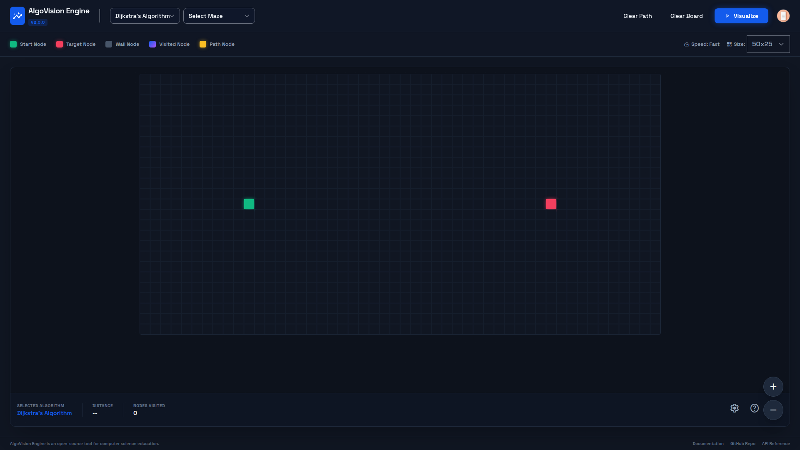

# ALGO VISION ENGINE

A high-performance, interactive visualization tool for graph traversal algorithms, demonstrating shortest-path logic in real-time.

## Live Demo
🚀 [View Live Deployment](https://2026-02-02-algo-vision-engine.vercel.app)

## About
AlgoVision Engine is a high-performance web application designed to visualize core graph traversal algorithms. It provides an interactive environment where users can manipulate the grid structure by adding barriers and observe how pathfinding logic (Breadth-First Search) navigates through obstacles to find the optimal route. This tool serves as a practical demonstration of data structures and DOM manipulation techniques.

## Features
• Interactive Visualization: Watch the algorithm explore the grid in real-time.
• Custom Grid Layout: Draw walls and complex maze patterns using mouse interactions.
• Pathfinding Logic: Implements an unweighted shortest path algorithm (BFS).
• Responsive UI: Clean, modern interface built with CSS Grid and Flexbox.
• State Management: Robust handling of grid states, resetting, and algorithm execution flows.

## Tech Stack
- HTML5, CSS3, Vanilla JavaScript
- Deployment: Vercel
  